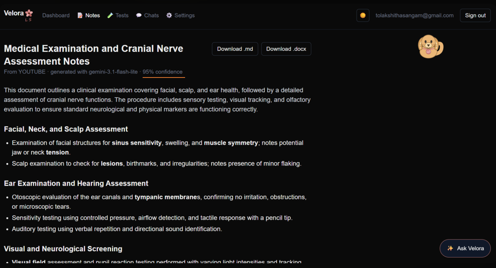

# Velora

Velora is an AI-powered learning platform that streamlines the entire study workflow. From lectures, PDFs, articles, recordings, transcripts, and live meetings, Velora generates structured notes, AI-powered practice tests, and personalized learning experiences to help students study smarter.

Whether you're revising for an exam, catching up on a missed lecture, or reinforcing concepts through quizzes and AI-powered conversations, Velora brings everything together in one intuitive workspace.

---

## Demo

Every clip below is a real recording of the application in use (muted and sped up for a quicker preview). Click any link to watch the corresponding feature.

---

## Authentication

▶️ **[Watch: Signing In](docs/videos/06-sign-in.mp4)**

Velora supports secure authentication through email and password or Google Sign-In, powered by NextAuth.js, providing users with a familiar and seamless login experience.

---

## AI Notes Generation

▶️ **[Watch: YouTube URL → Notes → Download as `.md` / `.docx`](docs/videos/01-notes-generation-and-export.mp4)**

Velora can generate notes from multiple types of learning material, including:

- YouTube videos
- Video caption URLs
- Web articles
- PDF documents
- Word and Excel files
- Audio and video recordings (transcribed using Whisper)
- Raw transcripts

Before anything is sent to Gemini, the extracted content is fetched and previewed, giving you the opportunity to review it before generating notes.

The demonstration above follows the complete workflow, from pasting a YouTube link and previewing the transcript to generating structured notes and exporting them as either Markdown or Microsoft Word. Exported `.docx` files are automatically formatted with headings and Times New Roman, making them ready to use for assignments or revision without additional formatting.

Generated notes are organized into clear sections with bullet points, highlighted keywords, and a confidence score indicating how complete and reliable the source material was. Lower confidence scores help identify incomplete transcripts or videos with poor captions.



---

## Live Meeting Notes

▶️ **[Watch: Live Meeting Capture](docs/videos/07-live-meeting-notes.mp4)**

Velora can capture audio from live lectures, meetings, and online classes to generate structured notes in real time. Instead of joining Zoom, Google Meet, or other platforms as a bot, audio is captured locally from a shared browser tab or system audio, similar to screen recording. This approach provides a seamless experience while keeping the meeting free from additional participants.

Using Deepgram for live transcription and Gemini for real-time summarization, Velora continuously converts spoken content into organized, structured notes as the session progresses. By the end of the lecture or meeting, your notes are already complete, eliminating the need to replay hours of recordings.

Before recording begins, users must explicitly acknowledge a disclosure checkbox (see the Legal Notice section below). Once permission is granted, the browser's native **"Sharing this tab..."** indicator is displayed, making it clear when audio capture is active.

<!-- Save the browser tab-sharing screenshot as docs/screenshots/live-meeting-consent.png, then uncomment: -->
<!--  -->

---

## AI Test Generation

▶️ **[Watch: Generate from a New Source → MCQ Test → Results → Retake](docs/videos/02-test-generation-and-taking.mp4)**

Velora can generate AI-powered practice tests from either an existing notes document or directly from a new learning source. Simply provide a YouTube link, choose the number of questions, select the test format, and Velora processes the content using the same ingestion pipeline as Notes Generation before creating a personalized assessment.

Supported question formats include:

- Multiple Choice
- Short Answer
- Mixed (MCQ + Short Answer)

### Smart Time Estimation

Each generated test includes a suggested completion time based on the selected question types:

- **Multiple Choice:** 1 minute per question
- **Short Answer:** 2.5 minutes per question

The recommended completion time is calculated based on the selected question types and rounded up accordingly. The timer is designed as a study aid rather than a strict time limit, allowing you to focus on learning without unnecessary pressure.

### Instant Grading & Performance Tracking

Once a test is submitted, Velora provides immediate feedback.

- Multiple-choice questions are graded instantly against the stored answers.
- Short-answer responses are evaluated by Gemini based on meaning rather than exact wording, allowing for natural, flexible answers.

Each short-answer response also includes a brief explanation highlighting what was correct, what was missing, and how the answer could be improved.

Performance is tracked across every attempt, displaying:

- Latest score
- Best score
- Average score
- Progress trend over time

### Smart Retakes

When regenerating a test, the **"Repeat a few old questions?"** option lets you choose between:

- A completely new set of questions
- A mixed test containing both new and previously attempted questions

This makes it easier to revisit concepts you struggled with while still introducing fresh practice material.

---

▶️ **[Watch: Paste Transcript → Generate Notes → Mixed Test](docs/videos/05-transcript-to-mixed-test.mp4)**

This workflow demonstrates how Velora can generate a complete study session from nothing more than pasted text.

Already have a transcript? Simply paste it into Velora, and it will instantly transform the content into well-structured notes. Whether the transcript comes from lecture captions, class notes, or another written source, the generated notes can be reused to create AI-powered practice tests without requiring the original material again.

The demonstration showcases the **Mixed** question format, combining multiple-choice and short-answer questions into a single assessment.

Because short-answer responses are evaluated based on semantic meaning rather than exact phrasing, even incomplete or partially correct answers receive meaningful feedback instead of being marked simply as incorrect.

Throughout the entire workflow, your animated study companion remains visible, reacting to your progress and making study sessions feel more engaging.

---

## Ask Velora

▶️ **[Watch: Explaining Test Mistakes → Generating Flashcards](docs/videos/03-ask-velora-mistakes-and-flashcards.mp4)**

Ask Velora is an AI-powered study assistant available from every page of the application. Unlike a general-purpose chatbot, it understands the notes document or test you're currently working on, allowing it to provide context-aware explanations and study support.

In the demonstration above, Ask Velora is used immediately after completing a test. It identifies the questions answered incorrectly, explains the correct answers, and focuses on the underlying concepts rather than simply displaying the score.

It can also generate interactive flashcards directly within the chat, transforming mistakes into personalized revision material without requiring you to leave your current study session.

Conversations are automatically organized by topic instead of page. Whether you open the chat from a notes document, a test, or its results page, the same conversation continues seamlessly and remains accessible later from the **Chats** tab.

<!-- Save the Chats tab screenshot as docs/screenshots/chats.png, then uncomment: -->
<!--  -->

---

## Animated Study Companion

▶️ **[Watch: Petting & Feeding the Mascot → Settings](docs/videos/04-mascot-and-settings.mp4)**

Velora includes a customizable animated study companion that remains visible throughout the application, making study sessions more engaging without interfering with your workflow.

The animated study companion responds dynamically to events throughout the app. It thinks while AI content is being generated, celebrates completed tests, and reacts to errors in real time. When idle, it follows its own animations like walking around the screen, exploring, and occasionally taking a well-earned nap.

Interacting with the mascot opens an expanded view where it can be petted with a click or fed by dragging a treat onto it. Every companion has its own animations, sound effects, and favourite treat.

Users can choose from seven different companions:

- 🐱 Cat
- 🐶 Puppy
- 🐹 Hamster
- 🐰 Rabbit
- 🐨 Koala
- 🐼 Panda
- 🦉 Owl

The preferred companion can be changed instantly from **Settings → Personal Study Partner**, with updates applied across the application without requiring a page refresh.

---

# Tech Stack

### Frontend

- Next.js (App Router)
- React
- TypeScript
- Tailwind CSS

### Backend

- Prisma ORM
- PostgreSQL

### Authentication

- NextAuth.js
  - Email & Password
  - Google Sign-In

### AI Services

- Google Gemini (`@google/genai`)
  - Notes generation
  - Test generation
  - AI grading
  - Ask Velora

- Deepgram
  - Live meeting transcription

- OpenAI Whisper *(optional)*
  - Audio and video transcription

### Additional Notes

All mascot artwork is built using hand-authored inline SVGs. No external image assets or animation libraries are used.

---

# Getting Started

## 1. Install Dependencies

```bash
npm install
```

## 2. Set Up PostgreSQL

You can use either of the following options:

### Neon (Recommended)

Create a free Neon database and copy the provided connection string.

No Docker or local PostgreSQL installation is required.

### Local PostgreSQL

Run PostgreSQL locally using Docker:

```bash
docker compose up -d
```

> Requires Docker Desktop.

---

## 3. Configure Environment Variables

Copy the example environment file:

```bash
cp .env.example .env
```

Configure the following variables:

| Variable | Description |
|----------|-------------|
| `DATABASE_URL` | PostgreSQL connection string (Neon or local Docker instance). |
| `AUTH_SECRET` | Generate using `npx auth secret`. |
| `AUTH_GOOGLE_ID` | Optional. Required only for Google authentication. |
| `AUTH_GOOGLE_SECRET` | Optional. Required only for Google authentication. |
| `GEMINI_API_KEY` | Required for notes generation, tests, grading, and Ask Velora. |
| `DEEPGRAM_API_KEY` | Required only for the Live Meeting Notes feature. |
| `OPENAI_API_KEY` | Optional. Required only for audio and video transcription using Whisper. |

---

## 4. Run Database Migrations

```bash
npx prisma migrate dev
```

---

## 5. Start the Development Server

```bash
npm run dev
```

Open **http://localhost:3000** in your browser.

---

# Project Structure

```text
src/
│
├── app/
│   ├── api/
│   └── (dashboard)/
│
├── components/
│   ├── meetings/
│   ├── AskVelora.tsx
│   └── Mascot*/
│
├── lib/
│   ├── ai/
│   ├── ingestion/
│   ├── meetings/
│   ├── storage/
│   └── time-estimate.ts
│
└── prisma/
```

### Directory Overview

| Directory | Purpose |
|-----------|---------|
| `src/lib/ingestion` | Extracts content from YouTube, PDFs, Word, Excel, audio, video, articles, and transcripts into a common format. |
| `src/lib/ai` | Gemini integration for notes, tests, grading, Ask Velora, prompts, and schemas. |
| `src/lib/time-estimate.ts` | Calculates suggested completion times for generated tests. |
| `src/app/api` | REST API routes for notes, tests, sources, chats, and AI services. |
| `src/app/(dashboard)` | Main authenticated application. |
| `src/lib/meetings` & `src/components/meetings` | Live meeting transcription and user interface. |
| `src/components/AskVelora.tsx` | Floating AI chat assistant with contextual conversations. |
| `src/components/Mascot*` | Animated study companion system and SVG mascot components. |

---

# Legal Notice

The Live Meeting Notes feature does **not** join Zoom, Google Meet, or any other conferencing platform as a bot.

Instead, it captures audio locally from a browser tab or shared screen, similar to standard screen recording. Before recording begins, Velora requires users to explicitly acknowledge a disclosure checkbox in both the user interface and backend validation.

Recording laws vary across jurisdictions. Users are responsible for informing meeting participants and complying with applicable consent requirements.

---

## 🚀 Future Enhancements

Velora is continuously evolving, with several improvements planned to enhance the learning experience and shape the future of the platform.

- ☁️ **Cloud Storage Support**
  Replace local file storage with cloud-based solutions such as Vercel Blob or Amazon S3 for improved scalability and deployment.

- 📱 **Cross-Platform Experience**
  Expand support across different browsers and platforms while improving compatibility for Live Meeting Notes.

- 📊 **Production-Ready API Management**
  Introduce API rate limiting, usage monitoring, and cost controls for AI-powered features to improve scalability and reliability.

- 🎥 **Enhanced Content Ingestion**
  Improve transcript extraction reliability and expand support for additional learning resources and content providers.
